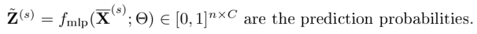

- Resource: https://github.com/dmlc/dgl/tree/master/examples/pytorch/grand

- Author's code: https://github.com/THUDM/GRAND

- Paper: https://arxiv.org/abs/2005.11079

- Illustration of GRAND in the paper

- DropNode

- Propagation: adopt the mixed-order propagation

- Prediction

We can apply softmax (or log_softmax followed by exp) to the output of of the MLP layer so that we can compute loss assuming positive prediction.

- Loss 

Note the following:

*  is detached from the computation graph in the code. Thus its gradient is not computed in the loss function.
* The original code computes training accuracy over one output , but we computes average accuracy over the list of outputs.
* Each of   has nonnegative entries whose sum is one.
