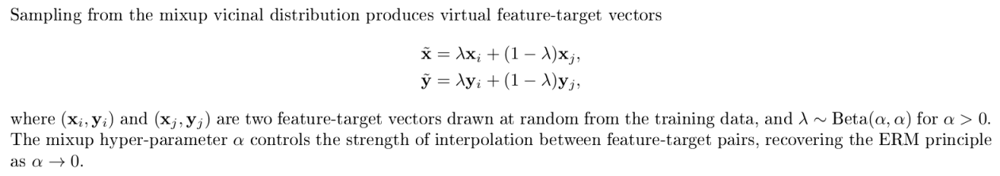
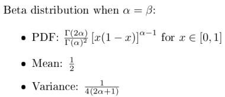

* Source code: https://github.com/facebookresearch/mixup-cifar10
* Paper: https://arxiv.org/abs/1710.09412

The mixup vicinal distribution can be understood as a form of data augmentation that encourages the model to behave linearly in-between training examples. 

* Beta distribution:

